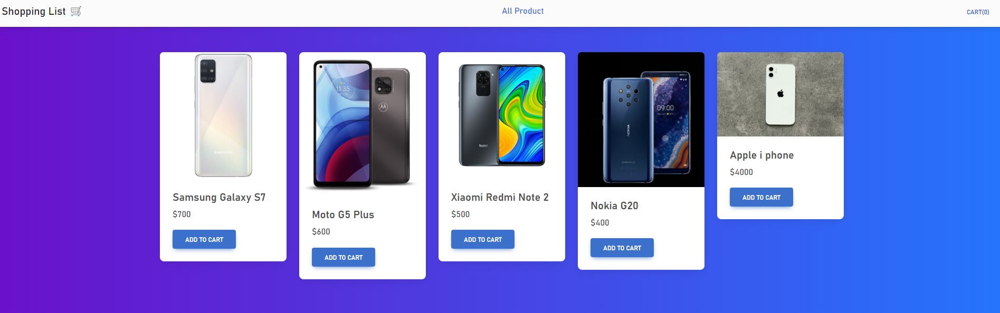
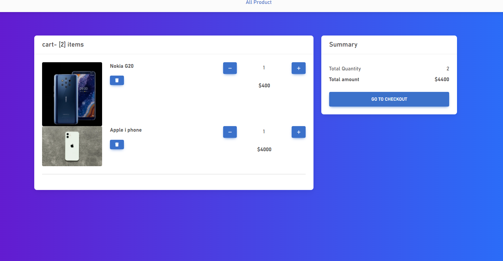

# 🚩 Shopping Mall

   
  
  
   

   
* 데모앱🎬 : https://sc-shoopingcart.netlify.app
   

  
## 📌 프로젝트 소개

   
shopping 웹사이트를 구현하면서 느꼈던 component가 많아질수록 props 통해 
state들을 공유하는 방식에 불편함을 느끼고 상태관리 라이브러리인 redux-toolkit 사용한 프로젝트입니다. 

* 개발 인원: 1명(개인 프로젝트)
* Deployment: github
* FrontEnd: React-Router-Dom, redux-toolkit, MDBootstrap

 

## 🔨 기술 스택

|    React    | 
| :--------:  |
|  ![react]   |

 

## 🔍 구현 기능

#### 카트에 아이템 담기, 삭제

#### 아이템 차순 정렬

#### 아이템 수량 증가, 감소

#### 아이템 총 수량, 가격을 동적 구현

 

## ✏️ 배운 점 & 아쉬운 점

부모로부터 값을 물려받는 작업은 props를 통해 이루어지는데 부모와 자식 사이에 여러 컴포넌트가 포함되어 있다면 포함된 컴포넌트에 모두 props를 전달해 주어야 합니다. 
  
사이에 있는 컴포넌트 중 해당 props가 필요하지도 않은데 자식 컴포넌트에 props를 전달하기 위해 전달 과정에 포함된 컴포넌트가 있고
component에 양이 늘어날수록 props로 state를 전달하는 방식이 비효율적이라 느꼈습니다.  
  
props drilling의 깊이가 깊어질수록 데이터를 추적하기가 어려워진다는 문제에서 벗어나기 위해
상태관리 라이브러리인 redux-toolkit를 학습할 겸 redux-toolkit를 사용해서 간단한 shopping cart를 구현했습니다.

확실히 사용하기 정말 편리하고, 가독성도 너무 좋아서 규모있는 프로젝트를 하게 된다면 Redux Toolkit을 쓰지 않을까 느꼈습니다.

  

 

<!-- Stack Icon Refernces -->

[react]: src/imgs/react.svg
